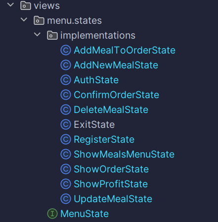
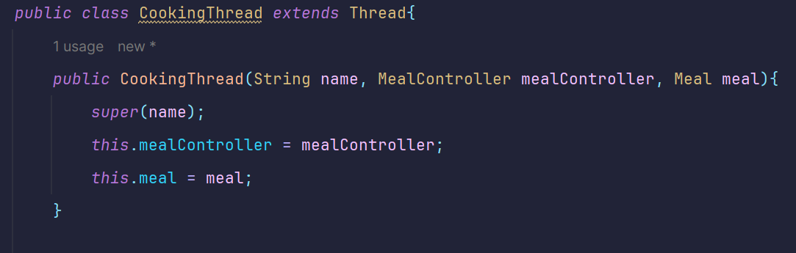

# Структура проекта
## Архитектура
Была попытка написать слоистую архитектуру.
## Паттерны проектирования
В проекте использовался паттерн "Состояние". 
В качестве состояний выступают функции главного меню, реализующие интерфейс MenuState

Также использовался паттерн "Фасад" в классе RestaurantFacade, 
для того чтобы связать между собой меню и контроллеры.
## SOLID
За счет использования паттерна "Состояние" мы не привязываемся 
к конкретной реализацией состояния меню, что позволяет легко 
добавить новую функцию для меню. Таким образом мы соблюдаем принцип 
инверсии зависимостей и принципа открытости/закрытости для класса меню.
## Хранение данных
Для хранения данных использовалась сериализация. Данные хранятся в файлах
users.dat (Логин и хеш пароля для пользователя), meals.dat (Меню блюд), 
profit,dat (Прибыль).
## Многопоточность
Для обработки заказов используется несколько потоков. Каждый поток обрабатывает
определенный вид блюда в заказе. Многопоточная обработка находится в классе ConfirmOrderState

## Типы пользователей и аутентификация
Есть 2 типа пользователей: админы и клиенты.
Чтобы зайти как админ нужно войти в аккаунт с логином 
admin и паролем admin. Все остальные аккаунты, которые 
вы зарегистрируете будут клиентами.

У клиента нет прав на изменения меню ресторана и
просмотр прибыли с продажи блюд.

Часть команд недоступна, если вы не вошли в какой-либо аккаунт.

Для хеширования паролей использовался BCrypt.

